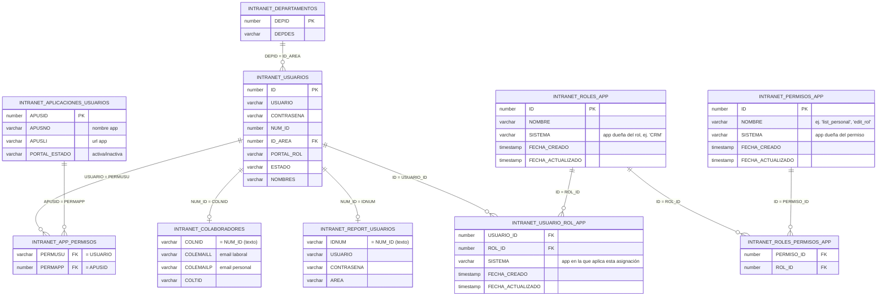

# Cómo se relacionan las tablas del Login

Todas las tablas viven en el esquema Oracle `BDLIGA` y se consultan desde
[`app/queries/user_queries.py`](app/queries/user_queries.py). El punto de
partida es siempre `INTRANET_USUARIOS`; el resto de tablas se van uniendo
(LEFT JOIN) a partir del usuario para completar sus datos.

## Diagrama



## Explicación tabla por tabla

### 1. `INTRANET_USUARIOS` (tabla central)
Es la tabla de login: guarda `USUARIO`, `CONTRASENA`, el número de
identificación (`NUM_ID`), el área (`ID_AREA`), el rol del portal
(`PORTAL_ROL`) y el estado (`ESTADO`). Todas las demás tablas se
"cuelgan" de aquí.

### 2. `INTRANET_DEPARTAMENTOS`
Se une por `ID_AREA = DEPID` para traducir el área del usuario a un
nombre legible (`DEPDES`). Relación: **muchos usuarios → un departamento**.

### 3. `INTRANET_COLABORADORES`
Se une convirtiendo `NUM_ID` a texto y comparándolo con `COLNID`. Aporta
los correos (`COLEMAILL` = laboral, `COLEMAILP` = personal) y el tipo de
colaborador (`COLTID`). Relación: **uno a uno (opcional)**, por eso es
`LEFT JOIN` — no todos los usuarios tienen colaborador asociado.

### 4. `INTRANET_REPORT_USUARIOS`
También se une por `NUM_ID = IDNUM` (como texto). Guarda credenciales y
área de un sistema de reportes aparte (`CONTRASENA_REPORT`,
`REPORT_USUARIO`). Igual que arriba, es opcional (`LEFT JOIN`).

### 5. `INTRANET_APP_PERMISOS`
Tabla puente: relaciona un `USUARIO` (`PERMUSU`) con una aplicación
(`PERMAPP`). Es lo que permite que **un usuario tenga varias apps** y
que **una app tenga varios usuarios** (muchos-a-muchos).

### 6. `INTRANET_APLICACIONES_USUARIOS`
Catálogo de aplicaciones del portal: `APUSID` (id), `APUSNO` (nombre),
`APUSLI` (URL) y `PORTAL_ESTADO` (si está activa o inactiva). Se llega a
ella desde `INTRANET_APP_PERMISOS.PERMAPP = APUSID`.

### 7. `INTRANET_ROLES_APP`
Catálogo de roles (ej. "Admin", "Navegadora", "Integradora", "Consulta").
La columna **`SISTEMA` es el nombre de la app dueña de ese rol** (ej.
`'CRM'`, `'PLANLIGA'`) — no es una FK a `INTRANET_APLICACIONES_USUARIOS`,
es texto libre. Esto permite que **una sola tabla de roles sirva para
todas las apps del portal**: cada app filtra sus propios roles por
`SISTEMA` en vez de tener su propia tabla `ROLES` duplicada.

### 8. `INTRANET_PERMISOS_APP`
Catálogo de permisos granulares por acción (ej. `list_personal`,
`edit_rol`, `delete_formulario`). Igual que en roles, `SISTEMA` marca a
qué app pertenece cada permiso.

### 9. `INTRANET_ROLES_PERMISOS_APP`
Tabla puente: qué permisos (`PERMISO_ID`) tiene cada rol (`ROL_ID`).
Relación muchos-a-muchos entre `INTRANET_ROLES_APP` e `INTRANET_PERMISOS_APP`.

### 10. `INTRANET_USUARIO_ROL_APP`
Tabla puente: qué rol(es) (`ROL_ID`) tiene cada usuario (`USUARIO_ID`,
FK a `INTRANET_USUARIOS.ID`). Relación muchos-a-muchos — un usuario
puede tener roles distintos en distintos sistemas (ej. "Admin" en CRM y
"Consulta" en PLANLIGA).

También trae su propio `SISTEMA` (además del que ya tiene
`INTRANET_ROLES_APP`), a propósito: es un campo desnormalizado para que
**cualquiera de las dos tablas** (`INTRANET_ROLES_APP` o
`INTRANET_USUARIO_ROL_APP`) diga de una vez a qué sistema pertenece,
sin tener que hacer JOIN entre ambas solo para saberlo.

Al ser desnormalizado, hay que mantenerlo sincronizado a mano: cuando
se asigna un rol a un usuario, el `SISTEMA` que se guarda en
`INTRANET_USUARIO_ROL_APP` debe copiarse del `SISTEMA` de ese mismo rol
en `INTRANET_ROLES_APP` (en el backend, al hacer el INSERT).

**Cómo se diferencia esto de lo que ya existía:**
- `PORTAL_ROL` (columna en `INTRANET_USUARIOS`): un único rol global de
  texto libre, sin granularidad por app ni por permiso. Se mantiene por
  compatibilidad, pero no se relaciona con este nuevo esquema.
- `INTRANET_APP_PERMISOS`: solo dice **si** un usuario puede entrar a una
  app (sí/no), no **qué puede hacer** dentro de ella.
- `INTRANET_ROLES_APP` / `INTRANET_PERMISOS_APP` / `INTRANET_ROLES_PERMISOS_APP` /
  `INTRANET_USUARIO_ROL_APP` (nuevo): sistema de permisos granular
  por acción y por app, para controlar qué botones/menús/endpoints ve
  cada usuario dentro de cada sistema al que ya tiene acceso.

Consulta típica (permisos de un usuario dentro de un sistema puntual):
```sql
SELECT DISTINCT p.NOMBRE
FROM INTRANET_USUARIOS u
JOIN INTRANET_USUARIO_ROL_APP sur ON sur.USUARIO_ID = u.ID
JOIN INTRANET_ROLES_APP r                  ON r.ID = sur.ROL_ID
JOIN INTRANET_ROLES_PERMISOS_APP rp        ON rp.ROL_ID = r.ID
JOIN INTRANET_PERMISOS_APP p               ON p.ID = rp.PERMISO_ID
WHERE u.ID = :id_usuario
  AND r.SISTEMA = :sistema;
```

## Flujo típico (login)

1. El usuario envía `USUARIO` + `CONTRASENA` (`AUTH_USER_QUERY`).
2. Se busca en `INTRANET_USUARIOS` y se completan datos de
   `INTRANET_DEPARTAMENTOS`, `INTRANET_COLABORADORES` e
   `INTRANET_REPORT_USUARIOS` mediante `LEFT JOIN`.
3. Ya autenticado, `APPS_BY_USER_QUERY` busca en `INTRANET_APP_PERMISOS`
   qué aplicaciones (`INTRANET_APLICACIONES_USUARIOS`) tiene permitidas
   ese usuario, filtrando solo las que están `activa`.
