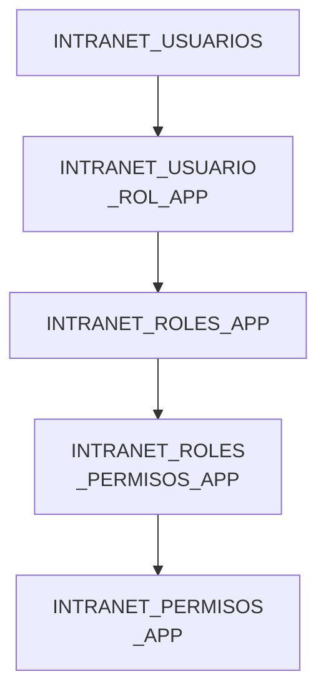
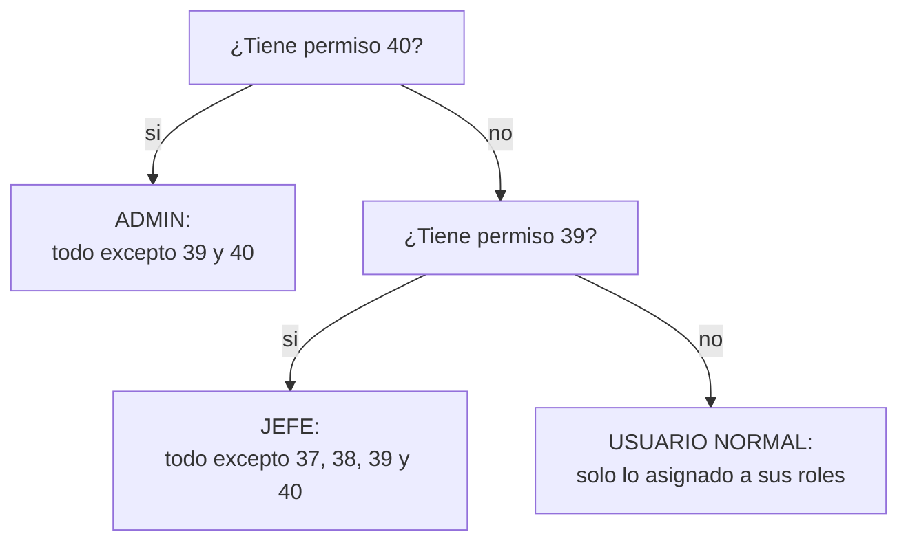

# Consultas de ejemplo — Permisos en app CRM

Consultas SQL de referencia para inspeccionar manualmente
Son para consulta/verificación directa en la base de datos  aqui os permisos estan en
[`AuthRepository.obtener_permisos`]

Ejemplo actual: sistema `CRM_MERCADEO`.



> **Para otras apps:** cambiar `'CRM_MERCADEO'` por el `SISTEMA`
> correspondiente . Idealmente `SISTEMA` y
> `USUARIO_ID` deben llegar como parámetros desde el código, no quedar
> escritos directamente en la consulta.

## 0. Ejemplo rápido: asignar un rol a un usuario

```sql
SELECT *
FROM INTRANET_USUARIOS
WHERE USUARIO = 'dgutierrezl';

INSERT INTO INTRANET_USUARIO_ROL_APP (USUARIO_ID, ROL_ID, SISTEMA)
VALUES ('119', '7', 'CRM_MERCADEO');

COMMIT;
```

## 1. Roles del usuario

Todos los roles que tiene el usuario `119`, solo los de `CRM_MERCADEO`.

```sql
SELECT USUARIO_ID,
       ROL_ID,
       SISTEMA
FROM INTRANET_USUARIO_ROL_APP
WHERE USUARIO_ID = '119'
  AND SISTEMA = 'CRM_MERCADEO';
```

## 2. Información de rol del usuario

ID y nombre del rol que tiene el usuario dentro de `CRM_MERCADEO`.

```sql
SELECT ID,
       NOMBRE,
       SISTEMA
FROM INTRANET_ROLES_APP
WHERE SISTEMA = 'CRM_MERCADEO'
  AND ID IN (
        SELECT ROL_ID
        FROM INTRANET_USUARIO_ROL_APP
        WHERE USUARIO_ID = '119'
          AND SISTEMA = 'CRM_MERCADEO'
      );
```

## 3. Permisos asignados al usuario

Permisos que el usuario recibe a través de sus roles (crudos, sin expandir comodines).

```sql
SELECT DISTINCT RP.PERMISO_ID
FROM INTRANET_ROLES_PERMISOS_APP RP
  WHERE RP.ROL_ID IN (
        SELECT UR.ROL_ID
        FROM INTRANET_USUARIO_ROL_APP UR
        WHERE UR.USUARIO_ID = '119'
      )
ORDER BY RP.PERMISO_ID;
```

## 4. Permisos especiales

`PERMISO 40 = ADMIN`, `PERMISO 39 = JEFE` — funcionan como comodín para
determinar qué conjunto de permisos puede consultar el usuario. Estos IDs
son específicos de esta configuración; para otra aplicación hay que validar
cuáles serán sus propios permisos especiales antes de reutilizar la lógica.



### 4.1 Permisos disponibles para ADMIN

Si el usuario tiene el permiso 40 (ADMIN): todos los permisos de `CRM_MERCADEO`, excepto los especiales 39 y 40.

```sql
SELECT *
FROM INTRANET_PERMISOS_APP
WHERE SISTEMA = 'CRM_MERCADEO'
  AND ID NOT IN (39, 40)
ORDER BY ID;
```

### 4.2 Permisos disponibles para JEFE

Si el usuario tiene el permiso 39 (JEFE) pero NO el 40 (ADMIN): todos los permisos, excepto configuración (37, 38) y los especiales 39 y 40.

```sql
SELECT *
FROM INTRANET_PERMISOS_APP
WHERE SISTEMA = 'CRM_MERCADEO'
  AND ID NOT IN (37, 38, 39, 40)
ORDER BY ID;
```

## 5. Permisos finales del usuario para login de CRM_MERCADEO

Combina los tres casos del diagrama de la sección 4 en una sola consulta.

```sql
WITH PERMISOS_USUARIO AS (

    -----------------------------------------------------------------------------
    -- Obtener los permisos de los roles del usuario
    -- únicamente dentro de CRM_MERCADEO.
    -----------------------------------------------------------------------------

    SELECT DISTINCT RP.PERMISO_ID
    FROM INTRANET_ROLES_PERMISOS_APP RP
      WHERE RP.ROL_ID IN (
            SELECT UR.ROL_ID
            FROM INTRANET_USUARIO_ROL_APP UR
            WHERE UR.USUARIO_ID = '119'          --- USUARIO DE EJEMPLO EN (INTRANET_USUARIO_ROL_APP)
              AND UR.SISTEMA = 'CRM_MERCADEO'
          )
)

SELECT P.SISTEMA,
       P.MODULO,
       P.ACCION
FROM INTRANET_PERMISOS_APP P
WHERE P.SISTEMA = 'CRM_MERCADEO'
  AND (

      -----------------------------------------------------------------------------
      -- CASO 1: ADMIN
      --
      -- Permiso 40 = ADMIN
      -----------------------------------------------------------------------------
      (
          EXISTS (
              SELECT 1
              FROM PERMISOS_USUARIO
              WHERE PERMISO_ID = 40
          )
          AND P.ID NOT IN (39, 40)
      )

      OR

      -----------------------------------------------------------------------------
      -- CASO 2: JEFE
      --
      -- Permiso 39 = JEFE
      -- No tiene permiso 40 = ADMIN
      -----------------------------------------------------------------------------
      (
          NOT EXISTS (
              SELECT 1
              FROM PERMISOS_USUARIO
              WHERE PERMISO_ID = 40
          )
          AND EXISTS (
              SELECT 1
              FROM PERMISOS_USUARIO
              WHERE PERMISO_ID = 39
          )
          AND P.ID NOT IN (37, 38, 39, 40)
      )

      OR

      -----------------------------------------------------------------------------
      -- CASO 3: USUARIO NORMAL
      --
      -- No tiene ni 39 (JEFE) ni 40 (ADMIN).
      --
      -- Solo devuelve los permisos que realmente tiene asignados
      -- mediante sus roles.
      -----------------------------------------------------------------------------
      (
          NOT EXISTS (
              SELECT 1
              FROM PERMISOS_USUARIO
              WHERE PERMISO_ID IN (39, 40)
          )
          AND P.ID IN (
              SELECT PERMISO_ID
              FROM PERMISOS_USUARIO
          )
      )
  )

ORDER BY P.ID;
```

## Notas para implementación en otras aplicaciones

- Cambiar `'CRM_MERCADEO'` por el `SISTEMA` correspondiente.
- `USUARIO_ID` debe venir del usuario autenticado
- Validar cuáles son los permisos especiales de esa app (ADMIN / JEFE / usuario normal) y sus IDs reales — aquí son `40 = ADMIN` y `39 = JEFE`, específicos de esta configuración.
- Mantener siempre el filtro por `SISTEMA` en `INTRANET_USUARIO_ROL_APP`, `INTRANET_ROLES_APP` e `INTRANET_PERMISOS_APP`, para no mezclar roles/permisos de otras apps.
