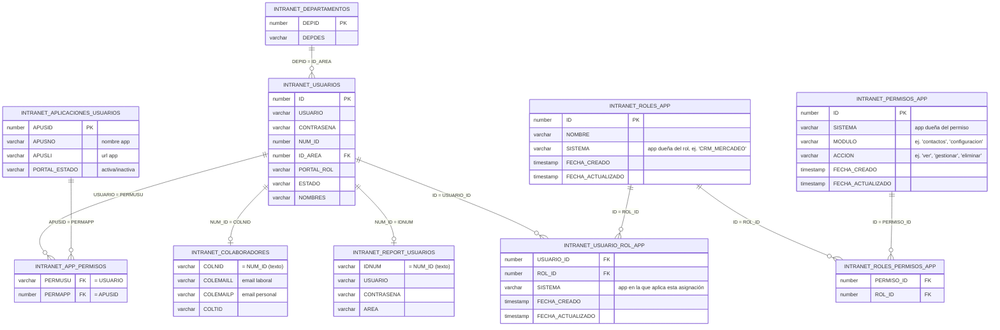
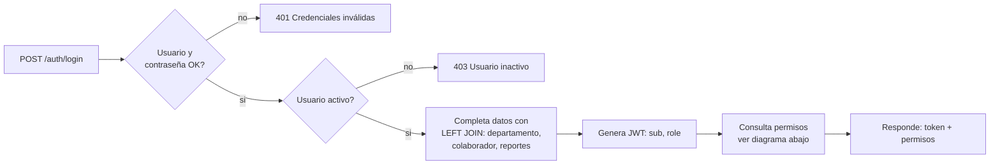
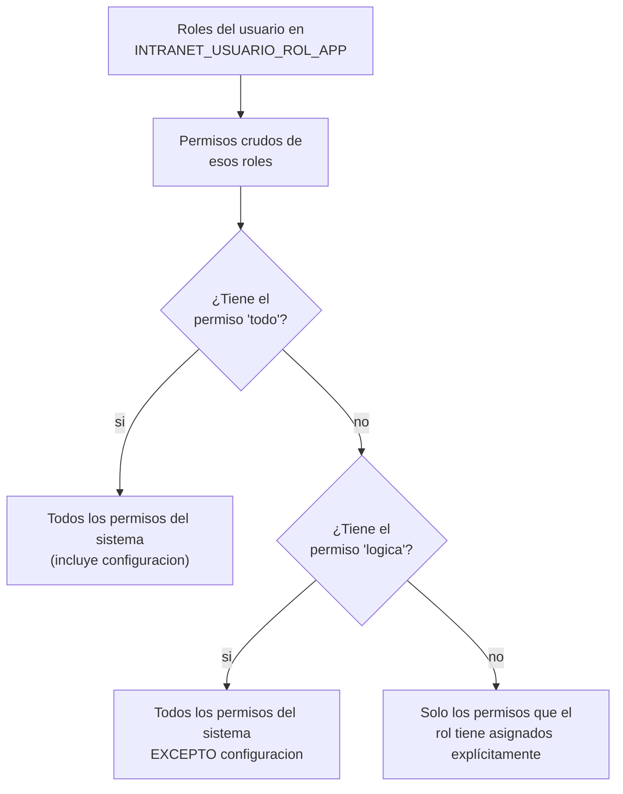

# Cómo se relacionan las tablas del Login

Todas las tablas viven en el esquema Oracle `BDLIGA` y se consultan desde
[`app/queries/user_queries.py`](../app/queries/user_queries.py). El punto de
partida es siempre `INTRANET_USUARIOS`; el resto de tablas se van uniendo
(LEFT JOIN) a partir del usuario para completar sus datos.

## Diagrama

## Qué hace cada tabla

| Tabla                            | Qué guarda                                                                                                         | Se une por                                            |
| -------------------------------- | ------------------------------------------------------------------------------------------------------------------- | ----------------------------------------------------- |
| `INTRANET_USUARIOS`              | Tabla central de login: usuario, contraseña, área,`PORTAL_ROL`, estado                                            | punto de partida de todo lo demás                    |
| `INTRANET_DEPARTAMENTOS`         | Nombre legible del área (`DEPDES`)                                                                                 | `ID_AREA = DEPID`                                     |
| `INTRANET_COLABORADORES`         | Correos laboral/personal, tipo de colaborador                                                                       | `NUM_ID` (texto) `= COLNID` — opcional (`LEFT JOIN`) |
| `INTRANET_REPORT_USUARIOS`       | Credenciales de un sistema de reportes aparte                                                                       | `NUM_ID` (texto) `= IDNUM` — opcional (`LEFT JOIN`)  |
| `INTRANET_APP_PERMISOS`          | Puente usuario ↔ aplicación:**si** puede entrar (sí/no), no **qué** puede hacer                                 | `PERMUSU = USUARIO`, `PERMAPP = APUSID`               |
| `INTRANET_APLICACIONES_USUARIOS` | Catálogo de apps del portal (nombre, URL, activa/inactiva)                                                         | `APUSID`                                              |
| `INTRANET_ROLES_APP`             | Catálogo de roles (ej. "Admin", "Jefe").`SISTEMA` = app dueña del rol — una sola tabla sirve para todas las apps | filtra por`SISTEMA`                                   |
| `INTRANET_PERMISOS_APP`          | Catálogo de permisos granulares por`MODULO` + `ACCION` (ej. `contactos` / `gestionar`)                             | filtra por`SISTEMA`                                   |
| `INTRANET_ROLES_PERMISOS_APP`    | Puente rol ↔ permiso (muchos a muchos)                                                                             | `ROL_ID`, `PERMISO_ID`                                |
| `INTRANET_USUARIO_ROL_APP`       | Puente usuario ↔ rol. Un usuario puede tener roles distintos en distintos sistemas                                 | `USUARIO_ID`, `ROL_ID`, `SISTEMA`                     |

**`PORTAL_ROL` vs. este esquema nuevo:** `PORTAL_ROL` es un único rol global
de texto libre en `INTRANET_USUARIOS`, sin granularidad — se mantiene por
compatibilidad pero no se relaciona con las 4 tablas de roles/permisos.
Esas 4 tablas son las que controlan qué botones/menús/endpoints ve cada
usuario dentro de cada sistema al que ya tiene acceso.

`INTRANET_USUARIO_ROL_APP.SISTEMA` está desnormalizado a propósito (se
repite el mismo dato que ya está en `INTRANET_ROLES_APP.SISTEMA`) para que
cualquiera de las dos tablas diga a qué sistema pertenece sin necesidad de
un JOIN extra. Al asignar un rol a un usuario, ese `SISTEMA` se copia del
rol elegido.

## Flujo de login

`APPS_BY_USER_QUERY` (fuera de este backend, en el portal) usa
`INTRANET_APP_PERMISOS` para decidir qué aplicaciones activas ve el usuario
en el menú del Intranet — es un paso previo y separado del login de cada
app individual.

## Resolución de permisos (ejemplo: CRM_MERCADEO)

Implementado en
[`AuthRepository.obtener_permisos`](../app/modules/auth/repository.py).
Dos `MODULO` funcionan como comodín dentro del catálogo de permisos y nunca
se devuelven tal cual — solo disparan una expansión:

Ver [`CONSULTAS_EJEMPLO_PERquiMISOS_APP.md`](CONSULTAS_EJEMPLO_PERMISOS_APP.md)
para las consultas SQL de referencia de este mismo flujo.
