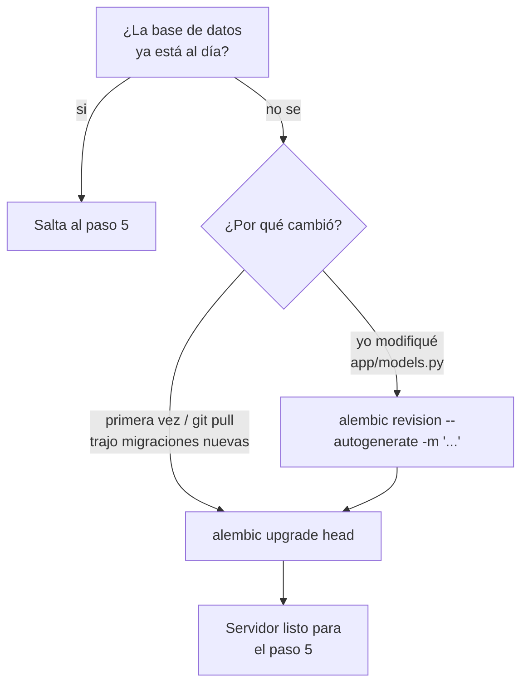

# Backend CRM Mercadeo

API construida con **FastAPI**, **SQLAlchemy** y **Alembic**, conectada a una base de datos **Oracle** (vía `oracledb`).

## Requisitos

- Python 3.10+
- Acceso a una base de datos Oracle (host, puerto, service name, usuario y contraseña)

## 1. Crear y activar el entorno virtual

Ya existe una carpeta `venv/` en el proyecto. Si necesitas recrearla:

```powershell
python -m venv venv
```

Activar el entorno virtual:

```powershell
# PowerShell
.\venv\Scripts\Activate.ps1
```

```bash
# Git Bash / WSL
source venv/Scripts/activate
```

## 2. Instalar dependencias

```powershell
pip install -r requirements.txt
```

## 3. Configurar variables de entorno

Copia el archivo de ejemplo y completa tus credenciales de Oracle:

```powershell
copy .env.example .env
```

Edita `.env` con tus datos:

```
SCSE_DB_USER=your_user
SCSE_DB_PASSWD=your_password
SCSE_DB_IP=localhost
SCSE_DB_PORT=1521
SCSE_DB_DATABASE=your_service_name
```

## 4. Migraciones con Alembic (solo cuando aplique)

Alembic no se ejecuta en cada arranque del servidor: solo entra en juego cuando el **esquema de la base de datos** (las tablas definidas en `app/models.py`) cambia o está desactualizado respecto al código.



- `alembic upgrade head` compara la base de datos contra el historial en `alembic/` y aplica las migraciones que falten (si no hay ninguna pendiente, no hace nada).
- `alembic revision --autogenerate` compara tus modelos contra la base de datos y genera el `ALTER TABLE`/`CREATE TABLE` en `alembic/versions/` — revísalo antes de aplicarlo, el autogenerate no siempre es perfecto.

**Comandos útiles para consultar el estado** (no modifican nada):

```powershell
alembic current   # revisión aplicada actualmente en la base de datos
alembic history   # historial completo de migraciones
```

## 5. levantar el servidor

```powershell
uvicorn main:app --reload
```

El servidor quedará disponible en `http://127.0.0.1:8000`.

- Documentación interactiva (Swagger): `http://127.0.0.1:8000/docs`
- Endpoint de verificación: `GET /health` → `{"status": "ok"}`

## Estructura del proyecto

```
backend_crm_mercadeo/
├── alembic/            # Migraciones de base de datos
├── app/
│   ├── database.py      # Configuración de conexión SQLAlchemy/Oracle
│   └── models.py        # Modelos ORM (tablas)
├── readme/              # Este archivo, diagrama de base de datos, consultas SQL de referencia
├── main.py              # Punto de entrada de la app FastAPI
├── requirements.txt      # Dependencias
├── alembic.ini           # Configuración de Alembic
└── .env                  # Variables de entorno (no versionado)
```
